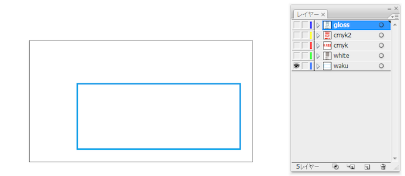
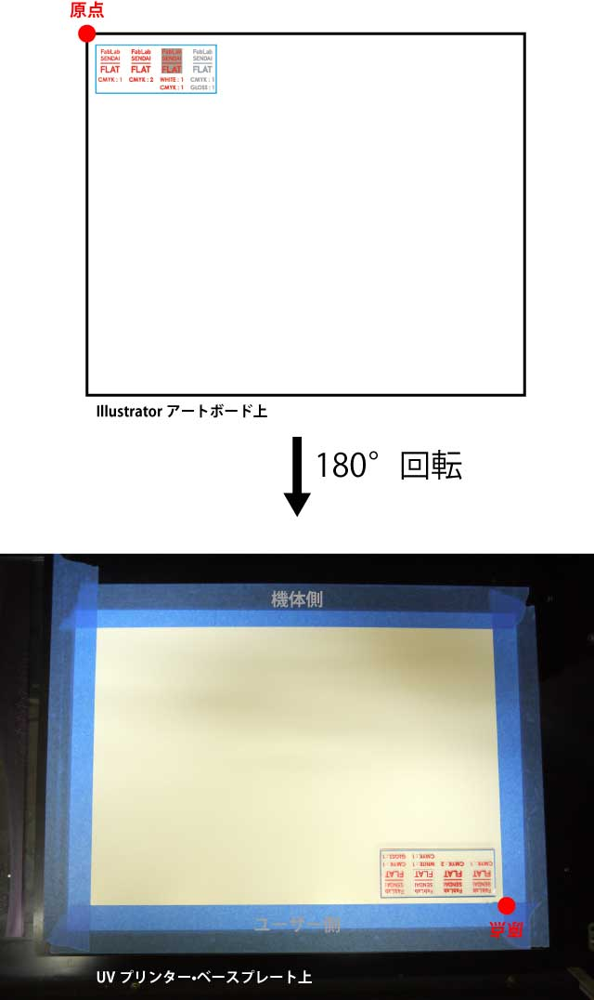

# 01.データの基本設定
  

## 01.1 事前準備
 

RolandDGより、以下3つのスウォッチライブラリが用意されています。 

* **Roland Grapac Bri-o-coat Library.ai**
* **Roland Texture System Library.ai**
* **Roland VersaWorks.ai**

これらを以下のフォルダに入れて、Illustratorを再起動します。 

* **Windowsの場合** 
ProgramFiles ＞ Adobe ＞ Adobe Illustrator ＞ プリセット ＞ スウォッチ 
* **Mac OSXの場合** 
アプリケーション ＞ Adobe Illustrator ＞ プリセット ＞ ja_JP ＞ スウォッチ 

※FLATのIllustratorには既にスウォッチライブラリが読み込まれています。 
もしスウォッチライブラリデータを欲しい場合はスタッフへ相談してください。 
 
 
 

## 01.2 ドキュメント設定
 

Adobe Illustratorの新規ドキュメントからデータを作成する場合、以下のように設定します。 

 
 

アートボードの幅と高さは、UVプリンタの**最大印刷範囲（305mm × 280mm）**に収まるよう、任意のサイズに設定します。 
カラーモードは**CMYK**を選択します。ラスタライズ効果は、数値を高くするほど綺麗に印刷されます。 
 
 
 

## 01.3 WHITEとGLOSSの割当て
 

UVプリンターではカラーインク（CMYKインク）だけでなく、特殊なインクを使うことができます。 
 

 
 

* **WHITE：**白色のインク。着色だけでなく、カラーインクをプリントする前のベースにも使用します。
* **GLOSS：**無色透明なインク。カラーインクの上にプリントすることで、様々な質感を与えることができます。

**ウィンドウ ＞ スウォッチライブラリ ＞ Roland VersaWorks** をクリックしてスウォッチウィンドウを呼び出し、 
必要に応じてオブジェクトの色を**RDG_WHITE** や **RDG_GLOSS**に設定します。 
 
 
 

## 01.4 レイヤー分け
 

CMYK（カラー）インク、WHITEインク、GLOSSインクは、UVプリンタ専用ソフトウェアで 
個別に設定する必要があるため、Adobe Illustrator上でインク別にレイヤー分けをしておきます。 
 

   

（左：GLOSSインクレイヤー／中：WHITEインクレイヤー／右：CMYK（カラー）インクレイヤー） 
 

 
 

3種類の印刷用レイヤーに加えて、材料の位置合わせをするための枠レイヤーも用意しておきます。 
（レイヤーの表示順は問いません。） 
 

* **WHITE：**白色のインク。着色だけでなく、カラーインクをプリントする前のベースにも使用します。
* **GLOSS：**無色透明なインク。カラーインクの上にプリントすることで、様々な質感を与えることができます。

**ウィンドウ ＞ スウォッチライブラリ ＞ Roland VersaWorks** をクリックしてスウォッチウィンドウを呼び出し、 
必要に応じてオブジェクトの色を**RDG_WHITE** や **RDG_GLOSS**に設定します。 
 
 
 

## 01.5 アートボードとデータプリント位置の確認
 

 
 

データは180度回転した状態で印刷されます。 
アートボードの左上がUVプリンタのベースプレートの右手前にくることから、 
Illustrator上のデザインとプリンタ上での印刷位置は上記のように対応します。
