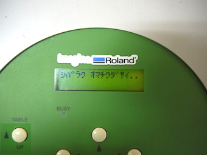
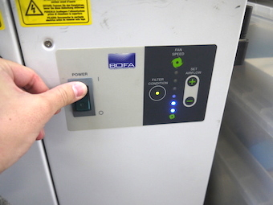

# 02.電源を入れる
  

 
 

UVプリンタ本体の右側にある操作パネルの**POWERボタン**を長押しします。 
 
 
 

 
 

ディスプレイに**『シバラクオマチクダサイ』**と表示され初期動作が始まるので、しばらく待ちます。 
 
 
 

 
 

初期動作が正常に終わると、ディスプレイに**『メディア ヲ セットアップ シテクダサイ』**と表示されます。 
この状態になったら、素材をUVプリンタにセットすることができるようになります。 
 
 
 

 
 

また、合わせてUVプリンタ下の脱臭装置の電源も入れておきます。 
 
 
 
