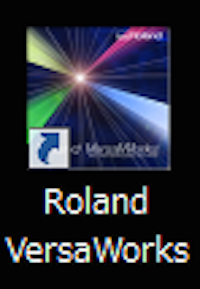
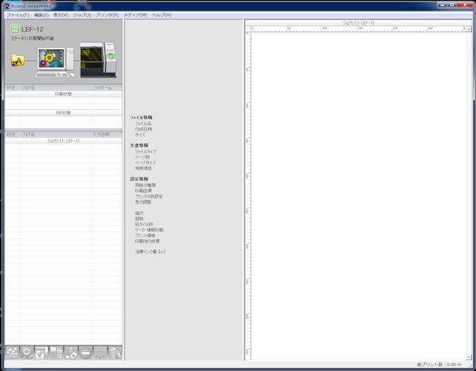
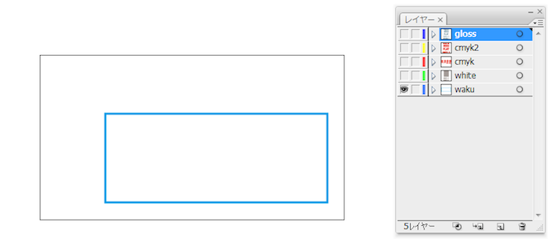
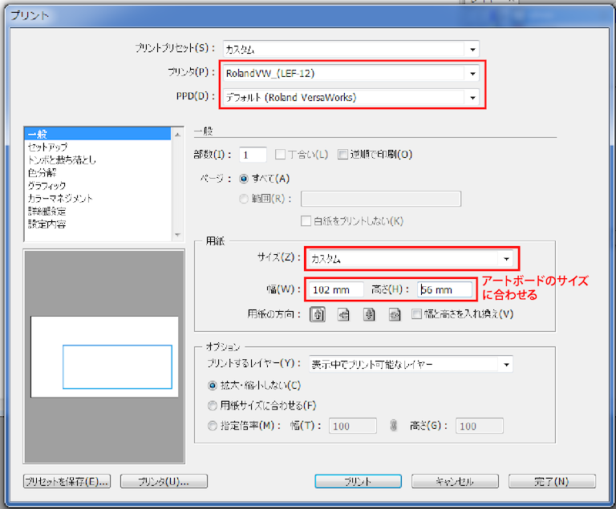
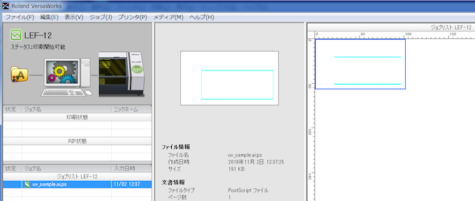

# 03-1.VersaWorksを起動〜Illustratorからデータ転送
  

## 03-1.1 VersaWorksを起動
 

 
 

デスクトップの**VersaWorks**のアイコンをクリックしソフトを起動します。 
 
 
 

 
 

**VersaWorks**はUVプリンタをコントロールするためのソフトウェアで、 
Adobe Illustratorからデータを受け取り、プリンターに命令を出してくれるものです。 
このソフトなしではUVプリンタを動かすことができないため、 
UVプリンタの電源を入れる際に、合わせてこのソフトを起動させておくと良いでしょう。 
 
 
 

## 03-1.2 VersaWorksを起動
 

 
 

Illustrator上で、枠（waku）以外のレイヤーを非表示にします。 
 
 
 

 
 

**ファイル** ＞ **プリント**をクリックし、プリント内容を上記のように設定します。 

* **プリンタ名：**RolandVW（LEF-12） 
* **用紙サイズ：**カスタム
* **用紙幅、高さ：**データのアートボードのサイズに合わせる

設定を上図のようにしたら**プリント**をクリックします。 
 
 
 

 
 

VersaWorksの画面を開き、上記のようにデータが表示されていればデータの転送は完了です。
