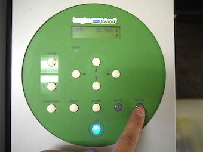
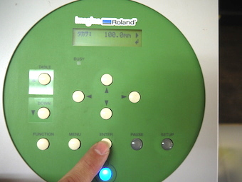
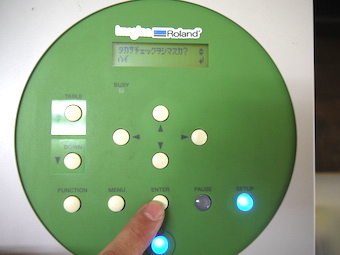
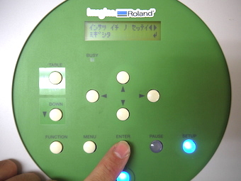
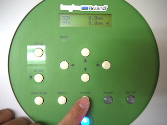
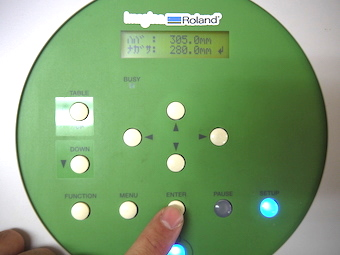
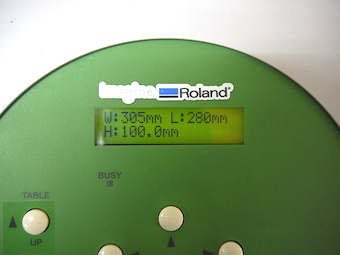

# 03-2.ベースプレートへの捨て紙のセット
  

本UVプリンタは、基本的に平らな面にしかプリントできません。 
また、インクノズルと素材が離れすぎているとUVインクが霧散し、機械の故障つながる可能性があるため、 
できるだけインクノズルと素材を近づけた状態でセットする必要があります。 
 
 
 

 
 

まず、**本体カバーを閉じて**からディスプレイに上のメッセージが表示されていることを確認します。 
 
 
 

 
 

右下の**SETUP**ボタンを押し、高さ設定画面を表示させます。 
 
 
 

 
 

左上の**TABLE UPボタン**を押し、高さを**100.0mm**に設定し **ENTERボタン**を押します。 
（素材にプリントする場合はそれぞれに合った高さに設定しますが、捨て紙の場合は100.0mmでOKです。） 
 
 
 

 
 

**『タカサチェックヲシマスカ？』**と表示されたら**ハイ**のまま **Enterボタン**を押します。 
そうするとベースプレートが動き出し、素材上面とノズル先端がぶつからないか自動でチェックされます。 
もし、ぶつかった場合には自動停止しますが、 
素材の重さよってはノズルに押し出され、プレートから落下しまうので注意が必要です。 
 
 
 

 
 

**『インサツ イチ ノ セッテイ』**と表示されたら、何もせずに**Enter**ボタンを押します。 
 
 
 

 
 

**『ヨコ0.0mm タテ0.0mm』**と表示されたら、何もせずに**Enter**ボタンを押します。 
 
 
 

 
 

**『ハバ ナガサ』**と表示されたら、何もせずに**Enter**ボタンを押します。 
 
 
 
 

 
 

上記のようにW（幅）、L（長さ）、H（高さ）が表示されれば、設定は完了です。 
 
 
 
