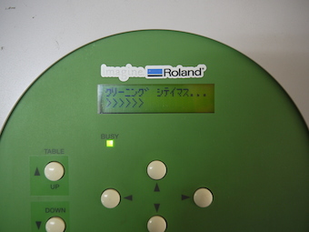

# 03-3.印刷開始
  

 
 

VersaWorks上で、先ほど送った枠のデータ名をダブルクリックします。 
 
 
 

 
 

**ジョブの設定**ウィンドウが表示されたら、左のメニューから**品質**をクリックし、 
品質設定の **モード** を **CMYK(v)** 、**カラー設定** を **MAX Impact** に設定します。 
（カラー設定は、印刷したい図柄に応じて変更します。） 
設定が完了したら、**OK**をクリックして元の画面に戻ります。 
 
 
 

 
 

画面左下の**印刷アイコン**をクリックし、プリントを開始します。 
 
 
 

 
 

プリント開始直後には、マシンの自動クリーニングが実施される場合がありますが、 
慌てずにそのままプリントが開始されるのを待ちます。 
（**BUSY**ランプが点灯している間は、何かしらの作業が実施されています。） 
 
 
 

 
 

クリーニングが終了すると、自動的にプリントが開始されます。 
 
 
 

 
 

ベースプレートが手前に出て**BUSY**ランプが消灯したらプリント終了です。 
