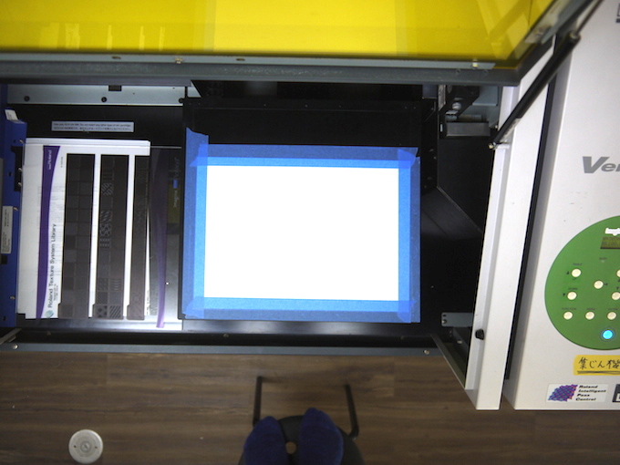

# 03.印刷位置をベースプレートにプリント
  

 
 

UVプリンタのベースプレート（素材をセットする台）には、マスキングテープで紙が貼り付けられています。 
（この紙を“捨て紙”と呼びます。） 
ベースプレートに捨て紙が貼られていなかったり、汚れすぎていたら、新しい紙に交換します。 

尚、この状態ではどこにデータがプリントされるか分かりません。 
そこで、まずは予め用意しておいた枠データ（素材のサイズになっているもの）を捨て紙に印刷します。
