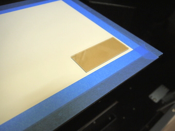

# 04.ベースプレートへの素材のセット
  

 
 

プリント面に油分が付着しているとインクが剥離しやすくなるため、 
アルコールを染み込ませたウェス等で表面を拭いておきます。 
 
 
 

  
 

ベースプレートに印刷した枠の線に合わせてアクリル板をセットします。 
もし、素材が軽すぎて動いてしまうようであれば、両面テープ等で固定しておきます。 
 
 
 

 
 

本体のカバーを閉めます。 
 
 
 

 
 

セットした素材上面とインクノズルとの距離を調整するために、 
**SETUP**ボタンを**長押し**します。 
 
 
 

 
 

**『メディア ヲ セットアップ シテクダサイ』**と表示されたら、再度**SETUP**ボタンを押します。 
 
 
 

 
 

**TABLE**の**DOWNボタン**を押して、ベースプレートを**「100.0mmー素材の厚さー10mm」**程度下げます。 
 
 
 

 
 

矢印ボタンの **↑** （上）を押し、本体内部にある衝突検知センサの下に 
素材がくるまでベースプレートを奥に移動させます。 
 
 
 

 
 

現時点では、横から見るとセンサーと材料の間が開きすぎているので、 
なるべく近づけるようにベースプレートの高さを調整させます。 
 
 
 

 
 

**UPボタン**を小刻みに押しながらベースプレートを上げ、 
センサーにできるだけ近づけつつも、素材とセンサーが触れないように調整します。 
 
 
 

 
 

素材とセンサーとのすき間が2mm以下程度になったら調整完了です。 
 
 
 

 
 

調整完了したら**ENTERボタン**を押します。 
 
 
 

 
 

[03-2.ベースプレートへの捨て紙のセット](/03-2-setup3-2.md)と同様に**ENTERボタン**を押していき、 
上記のような表示画面になったら調整完了です。 
 
 
 
