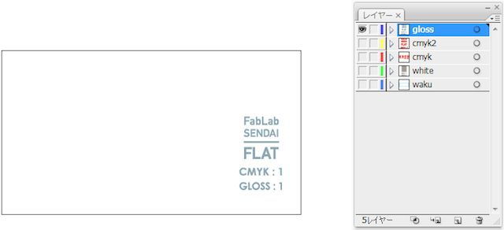
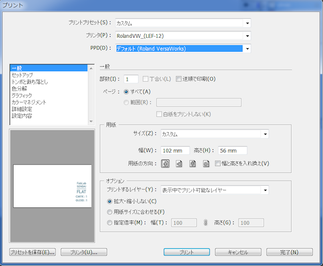
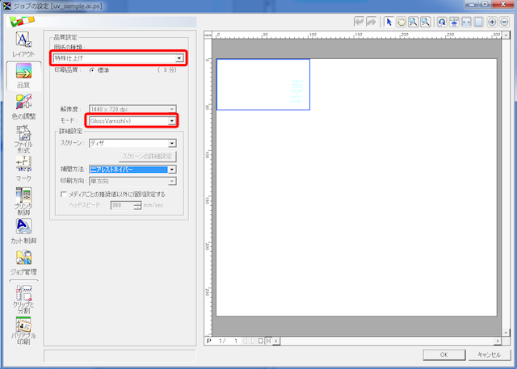
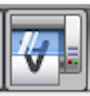
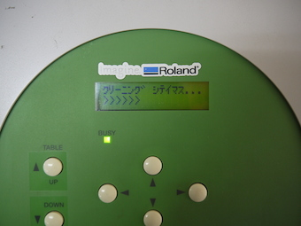
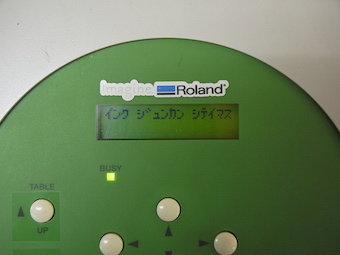
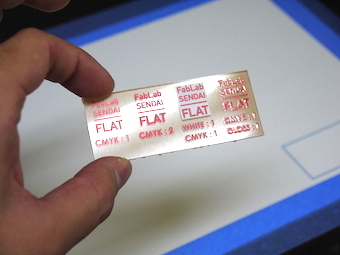

# 07.GLOSSプリント
  

 
 

Adobe Illustrator上で、GLOSS以外のレイヤーを非表示にします。 
 
 
 

 
 

**ファイル** ＞ **プリント**をクリックし、プリント設定画面を表示し、上記のように設定します。 
先に枠等をプリント済みの場合は、プリンタや用紙サイズ等の設定を枠と同じ内容に設定します。 
 
 
 

 
 

VersaWorks上で先ほど送ったGLOSSのデータ名をダブルクリックし、設定ウィンドウを表示させます。 
左側のメニューから**品質**を選択し、以下のように設定します。 

* **用紙の種類：**特殊仕上げ
* **モード：**Gloss Varnish(v)

（艶仕上げの場合はGloss Varnish(v)、マット仕上げの場合はMatte Varnish(v)を選択します。） 
設定が完了したら、**OK**をクリックして元の画面に戻ります。 
 
 
 

 
 

問題がなければ、画面左下の**印刷アイコン**をクリックし、プリントを開始します。 
 
 
 

  
 

プリント開始直後には、マシンの自動クリーニングやインク循環が実施される場合がありますが、 
慌てずにそのままプリントが開始されるのを待ちます。 
（**BUSY**ランプが点灯している間は、何かしらの作業が実施されています。） 
 
 
 

 
 

（※右端がグロスプリントが行われた箇所） 
クリーニングが終了すると、自動的にプリントが開始されます。 
ベースプレートが手前に出て**BUSY**ランプが消灯したらプリント終了です。 
 
 
 
